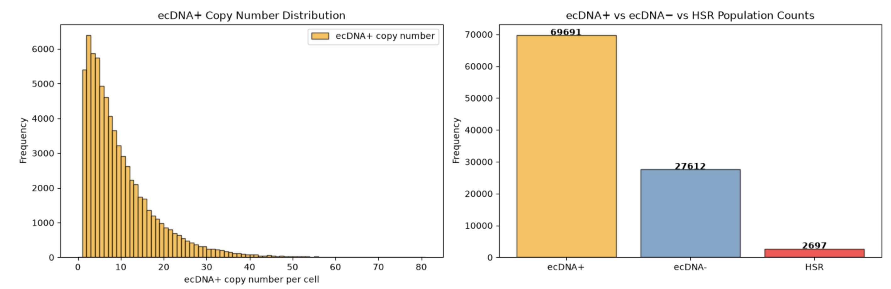

# The evolution of tumours with dynamic reintegration and excision of extrachromosomal DNA
A stochastic, agent-based model of **extrachromosomal DNA (ecDNA) dynamics** 
during tumour evolution and treatment response.

## Overview

Approximately 17% of cancers harbour amplified oncogenes on extrachromosomal DNA (ecDNA), with
ecDNA prevalence increasing three-fold in more aggressive tumours. These segments of amplified DNA
undergo random segregation, allowing rapid and heritable changes in ecDNA copy number which contributes to
tumour evolution and drug resistance. 

This model simulates ecDNA dynamics that drive tumour evolution and treatment resistance:
- **Reintegration**: ecDNA integrates into a chromosome, forming a homogeneously staining region (HSR) - a second amplification state.
- **Excision**: the reverse - an integrated ecDNA is excised back from the chromosome, returning the HSR
  amplification to an ecDNA amplification.
  
## Project aims 

1. Investigate how reintegration and excision shape copy-number distributions and population composition
   during tumour evolution in the absence of therapy.
2. Implement a three-phase treatment protocol to investigate its influence on tumour dynamics, including changes
   in population composition and copy-number distributions, and to determine whether ecDNA dynamics provide a
   mechanistic explanation for therapeutic resistance.

## Repository structure
- ['src/ecDNA_dynamics_model.py'](src/ecDNA_dynamics_model.py) - the overall/shared stochastic Gillespie model, used as the basis for both the untreated and treated model
- the original two-state population (validation) model.
- ['src/untreated_model'](src/untreated_model) - untreated tumour evolution model (code & plots) [Aim 1]
- treatment model (code & plots) [Aim 2] 

## Results

### 1. Untreated dynamics
    

#### 1.1. Base model confirms characterisation of ecDNA copy-number distribution

#### 1.2. Reintegration introduces HSR as a third cell state

Stochastic reintegration of ecDNA into the chromosome produces HSR amplifications, introducing a third cell state alongside ecDNA+ and ecDNA-. ecDNA+ cells occupy the largest fraction of the population due to their fitness advantage, while HSR remains the smaller subset. 

**Figure 1.2**. Left: **ecDNA+ copy-number distributions** at N= 10^5 cells (single run). Right: **Population composition with reintegration introduced**. Cell-state composition showing ecDNA+, ecDNA-, and     HSR cell counts, grown to Ntarget = 105 (single run) under reintegration and proportional cell death, p_int = 0.01 and standard parameters (*s*=1.5, *r*=1.2, *k*=0.1) are used. *Generated by:       ['untreated_model/result_1_2.py'](src/untreated_model/result_1_2.py)*

#### 1.3. Reintegration truncates the ecDNA copy-number tail 

#### 1.4. Reintegration and excision emergence is staggered

### 2. Treatment response

#### 2.1. ecDNA copy number tail is truncated by treatment and partially rebuilt by growth

#### 2.2. Treatment reshapes population composition

