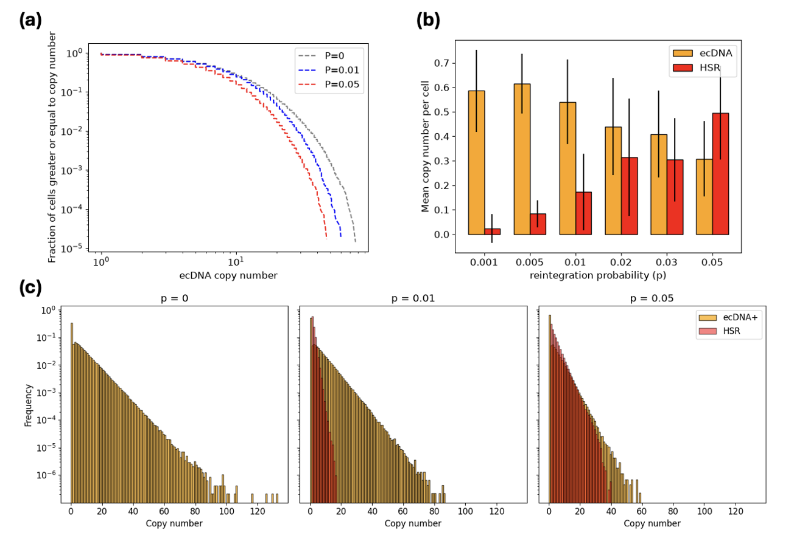
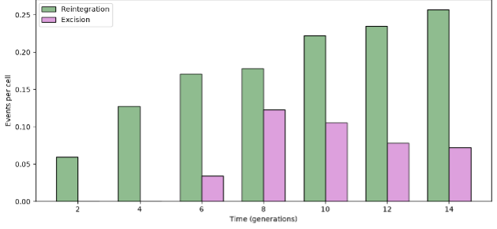

# The evolution of tumours with dynamic reintegration and excision of extrachromosomal DNA
A stochastic, agent-based model of **extrachromosomal DNA (ecDNA) dynamics** 
during tumour evolution and treatment response.

## Overview

Approximately 17% of cancers harbour amplified oncogenes on extrachromosomal DNA (ecDNA), with
ecDNA prevalence increasing three-fold in more aggressive tumours. These segments of amplified DNA
undergo random segregation, allowing rapid and extreme changes in ecDNA copy number which contributes to
tumour evolution and drug resistance. 

This model simulates ecDNA dynamics that drive tumour evolution and treatment resistance:
- **Reintegration**: ecDNA integrates into a chromosome, forming a homogeneously staining region (HSR) - a second amplification state.
- **Excision**: the reverse - an integrated ecDNA is excised back from the chromosome, returning the HSR
  amplification to an ecDNA amplification.
  
## Project aims 

1. Investigate how reintegration and excision shape copy-number distributions and population composition
   during tumour evolution in the absence of therapy.
2. Implement a three-phase treatment protocol to investigate its influence on tumour dynamics, including changes
   in population composition and copy-number distributions, and to determine whether ecDNA dynamics provide a
   mechanistic explanation for therapeutic resistance.

## Repository structure
- [ecDNA_dynamics_model](src/ecDNA_dynamics_model.py) - the overall/shared stochastic Gillespie model, used as the basis for both the untreated and treated model
- the original two-state population (validation) model.
- [untreated_model](src/untreated_model) - untreated tumour evolution model (code & plots) [Aim 1]
- treatment model (code & plots) [Aim 2] 

## Results

### 1. Untreated dynamics
    

#### 1.1. Base model confirms characterisation of ecDNA copy-number distribution

#### 1.2. Reintegration introduces HSR as a third cell state

Stochastic reintegration of ecDNA into the chromosome produces HSR amplifications, introducing a third cell state alongside ecDNA+ and ecDNA-. ecDNA+ cells occupy the largest fraction of the population due to their fitness advantage, while HSR remains the smaller subset. 

> Fig. 1.2. Left: **ecDNA+ copy-number distributions** at N= 10^5 cells (single run). Right: **Population composition with reintegration introduced**. Cell-state composition showing ecDNA+, ecDNA-, and     HSR cell counts, grown to Ntarget = 105 (single run) under reintegration and proportional cell death, p_int = 0.01 and standard parameters (*s*=1.5, *r*=1.2, *k*=0.1) are used.  *Generated by:       [result_1_2.py](src/untreated_model/result_1_2.py)* 

#### 1.3. Reintegration truncates the ecDNA copy-number tail 

The model demonstrates that reintegration shifts the distribution by suppressing high copy ecDNA+ cells and shifting those copy numbers into the HSR state. Full copy-number distributions were produced to reveal the spread of both amplification types across copy numbers and, to confirm the effect of reintegration probability on the tail (fig.1.3c), due to the mean collapsing the distribution into a single value as shown in fig. 1.3b. which hides the distribution shape. 

> Fig. 1.3. **Reintegration truncates the ecDNA copy-number tail**. **(a)** Distribution of ecDNA+ copy number (fraction of cells at or above each copy number) at three reintegration probabilities (p = 0, 0.01, 0.05). **(b)** Mean copy number per cell for ecDNA (s = 1.5, orange) and HSR (r = 1.2, red) across reintegration probabilities (0.001 - 0.05). Error bars show ± one standard deviation across runs. (c) Copy-number distributions of ecDNA+ (yellow) and HSR (red) at p=0, 0.01, and 0.05, on a logarithmic frequency axis. All simulations were run to Ntarget = 10^5 under the fully implemented model. *Generated by:       [result_1_3.py](src/untreated_model/result_1_3.py)*

#### 1.4. Reintegration and excision emergence appears sequentially
As both events coexist in the model, tracking when each occurs reveals the sequence in which HSR emerges and excision surfaces. The model demonstrates that reintegration and excision occurs sequentially and depends on an established ecDNA+ population. The model also reveals that even though reintegration climbs as the population grows, excision peaks and subsequently declines, this may the result of specific modelling rules in the .

  

> Fig. 1.4. **Reintegration an excision event rates across tumour growth**. Per-cell rates of reintegration (green) and excision (purple) over ecDNA+ tumour growth, expressed in generations (log2 of population size) and pooled across 50 runs. Reintegration rate is calculated per ecDNA+ cell and excision rate per HSR cell within each generation window. Simulations were run under the full untreated model at standard parameters. *Generated by: [result_1_4.py](src/untreated_model/result_1_4.py)*

### 2. Treatment response

#### 2.1. ecDNA copy number tail is truncated by treatment and partially rebuilt by growth

#### 2.2. Treatment reshapes population composition

